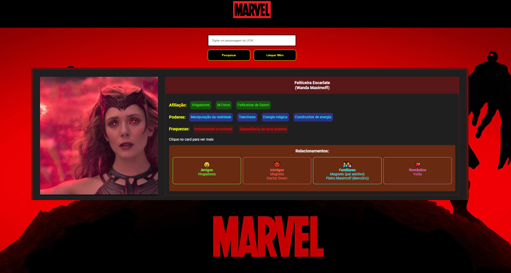

# Site de busca personagens da UCM

### Tecnologia
- javascript
- html
- css

### Desenvolvimento
- O filtro funciona ao buscar pelo trecho de nome ou o alias (nome de herói).
- Utilizado o session storage para persistencia dos dados ao navegar entre as telas.
- Dados gerados pelo Gemini.
- A pagina sobre cada heroi carrega imagem via url http.
- Ao clicar no card leva para pagina sobre o personagem.
- Limpar filtro lista todos os personagens.

